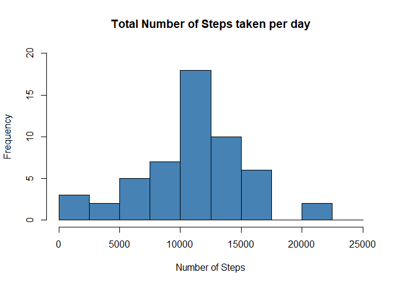
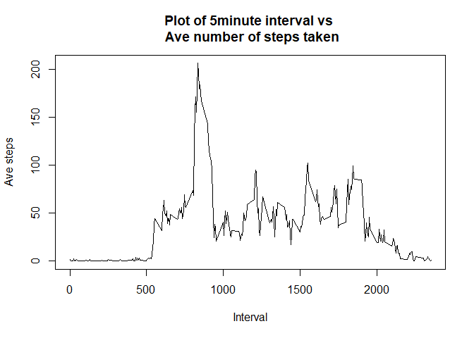
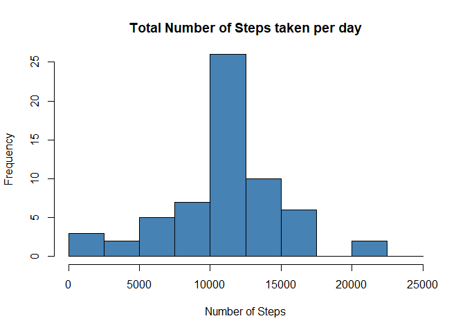
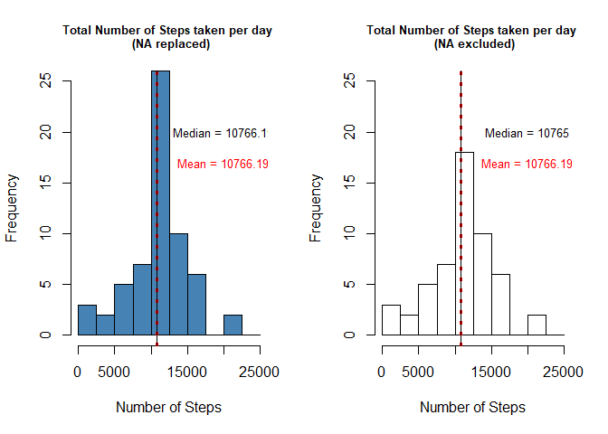
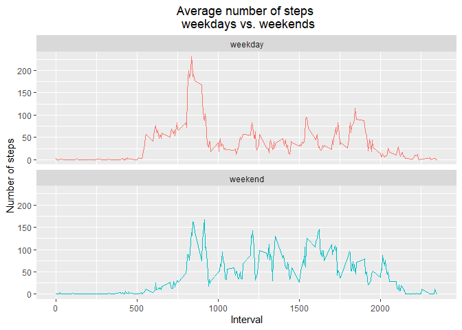

### **Introduction**
It is now possible to collect a large amount of data about personal movement using activity monitoring devices such as a Fitbit, Nike Fuelband, or Jawbone Up. These type of devices are part of the "quantified self" movement -- a group of enthusiasts who take measurements about themselves regularly to improve their health, to find patterns in their behavior, or because they are tech geeks. But these data remain under-utilized both because the raw data are hard to obtain and there is a lack of statistical methods and software for processing and interpreting the data.

This assignment makes use of data from a personal activity monitoring device. This device collects data at 5 minute intervals through out the day. The data consists of two months of data from an anonymous individual collected during the months of October and November, 2012 and include the number of steps taken in 5 minute intervals each day.

**Data**
The data for this assignment can be downloaded from the course web site:

**Dataset**: [Activity monitoring data](https://d396qusza40orc.cloudfront.net/repdata%2Fdata%2Factivity.zip) [52K]

The variables included in this dataset are:

  **steps**: Number of steps taking in a 5-minute interval (missing values are coded as NA)
  
  **date**: The date on which the measurement was taken in YYYY-MM-DD format
  
  **interval**: Identifier for the 5-minute interval in which measurement was taken

The dataset is stored in a comma-separated-value (CSV) file and there are a total of 17,568 observations in this dataset.

### **Assignment**

### Loading and preprocessing the data
Show any code that is needed to:

1. Load the data (i.e. read.csv())

- Load required libraries and perform pre-checks. The required dataset has been downloaded to the working directory and unzipped with filename "activity.csv":


```r
library(ggplot2)
library(dplyr)
```

```
## 
## Attaching package: 'dplyr'
```

```
## The following objects are masked from 'package:stats':
## 
##     filter, lag
```

```
## The following objects are masked from 'package:base':
## 
##     intersect, setdiff, setequal, union
```

```r
library(lubridate)
```

```
## 
## Attaching package: 'lubridate'
```

```
## The following objects are masked from 'package:base':
## 
##     date, intersect, setdiff, union
```


```r
## read dataset
data <- read.csv("activity.csv")
str(data)
```

```
## 'data.frame':	17568 obs. of  3 variables:
##  $ steps   : int  NA NA NA NA NA NA NA NA NA NA ...
##  $ date    : chr  "2012-10-01" "2012-10-01" "2012-10-01" "2012-10-01" ...
##  $ interval: int  0 5 10 15 20 25 30 35 40 45 ...
```

```r
days <- data %>%
        group_by(date) %>%
        summarise(count = n_distinct(date))
str(days)
```

```
## tibble [61 x 2] (S3: tbl_df/tbl/data.frame)
##  $ date : chr [1:61] "2012-10-01" "2012-10-02" "2012-10-03" "2012-10-04" ...
##  $ count: int [1:61] 1 1 1 1 1 1 1 1 1 1 ...
```

There are 61 days of data available, noting that some days have missing values recorded as **NA**.


2. Process/transform the data (if necessary) into a format suitable for your analysis
- Convert "$date" from *chr* to *date* type:

```r
data$date <- as.Date(data$date, "%Y-%m-%d")

## prevent scientific notation
options(scipen = 999) 
```


### What is mean total number of steps taken per day?
For this part of the assignment, missing values can be ignored in the dataset. *na.rm = TRUE* will be utilised in the syntax.

1. Calculate the total number of steps taken per day

```r
total_steps <- aggregate(steps ~ date, data = data, sum, na.rm = TRUE)
```

2. Make a histogram of the total number of steps taken each day

```r
hist(total_steps$steps, ylim = c(0, 20), col = "steelblue", xlab = "Number of Steps", 
     main = "Total Number of Steps taken per day", breaks = seq(0,25000, by=2500))
```

<!-- -->

3. Calculate and report the mean and median of the total number of steps taken per day
- Median and mean were calculated as follows:

```r
median(total_steps$steps, na.rm = TRUE)
```

```
## [1] 10765
```


```r
mean(total_steps$steps, na.rm = TRUE)
```

```
## [1] 10766.19
```

### What is the average daily activity pattern?
1. Make a time series plot (i.e. type = "l") of the 5-minute interval (x-axis) and the average number of steps taken, averaged across all days (y-axis)


```r
### calculate mean per interval 
by_interval <- aggregate(steps ~ interval, data = data, mean, na.rm = TRUE)

# plot instructions
with(by_interval, plot(interval, steps, type = "l", xlab = "Interval", ylab = "Ave steps", 
                       main = "Plot of 5minute interval vs \n Ave number of steps taken"))
```

<!-- -->

2. Which 5-minute interval, on average across all the days in the dataset, contains the maximum number of steps?


```r
by_interval[which.max(by_interval$steps),]$interval
```

```
## [1] 835
```

The "835" interval contains the maximum number of steps.

### Imputing missing values
Note that there are a number of days/intervals where there are missing values (coded as **NA**).
The presence of missing days may introduce bias into some calculations or summaries of the data.

1. Calculate and report the total number of missing values in the dataset (i.e. the total number of rows with **NA**s)


```r
## find number of NAs and where they are located
colSums(is.na(data))
```

```
##    steps     date interval 
##     2304        0        0
```

The output shows there are 2304 missing values in the *steps* variable.

- The proportion (as a percentage) of missing values can be determined with:

```r
mean(is.na(data$steps))*100
```

```
## [1] 13.11475
```

- From this resulting code, it is possible to see more specifically where the missing data lies. It shows that there were 8 days where there were no steps recorded.

```r
## find dates with missing data/no steps
missing <- data %>%
        filter(is.na(steps)) %>%
        group_by(date) %>%
        summarise(sum = sum(steps))
print(missing)
```

```
## # A tibble: 8 x 2
##   date         sum
##   <date>     <int>
## 1 2012-10-01    NA
## 2 2012-10-08    NA
## 3 2012-11-01    NA
## 4 2012-11-04    NA
## 5 2012-11-09    NA
## 6 2012-11-10    NA
## 7 2012-11-14    NA
## 8 2012-11-30    NA
```


2. Devise a strategy for filling in all of the missing values in the dataset. The strategy does not need to be sophisticated. For example, you could use the mean/median for that day, or the mean for that 5-minute interval, etc.
- The missing values (**NA**) will be replaced with the mean for the corresponding 5-minute interval. In order to do that:
a. calculate mean by time interval
b. find location of the **NA** and corresponding time interval
c. replace with the mean for that time interval

3. Create a new dataset that is equal to the original dataset but with the missing data filled in.

```r
## duplicate original dataset before transforming to one without NAs
data2 <- data

## Create dataframe with the mean values by interval
interval_mean <- aggregate(steps ~ interval, data = data2, mean, na.rm = TRUE)

## create new dataset with NA's filled with mean for the same interval. code adds new column 'noNA' to data2
## with the condition - if $steps is NA, then get the mean from interval_mean from the matching time 
## interval, else $steps is as is
data2$noNA <- ifelse(is.na(data2$steps), 
                     interval_mean$steps[match(data2$interval, interval_mean$interval)],
                     data2$steps)

## final dataset with no NAs
new_noNA <- data.frame(steps = data2$noNA, date = data2$date, interval = data2$interval)
```

- Both datasets have the same number of observations, with no **NA**'s in the new dataset:

```r
str(data)
```

```
## 'data.frame':	17568 obs. of  3 variables:
##  $ steps   : int  NA NA NA NA NA NA NA NA NA NA ...
##  $ date    : Date, format: "2012-10-01" "2012-10-01" ...
##  $ interval: int  0 5 10 15 20 25 30 35 40 45 ...
```

```r
str(new_noNA)
```

```
## 'data.frame':	17568 obs. of  3 variables:
##  $ steps   : num  1.717 0.3396 0.1321 0.1509 0.0755 ...
##  $ date    : Date, format: "2012-10-01" "2012-10-01" ...
##  $ interval: int  0 5 10 15 20 25 30 35 40 45 ...
```

```r
sum(is.na(new_noNA))
```

```
## [1] 0
```

4. This part has multiple requirements: 

- Make a histogram of the total number of steps taken each day


```r
## calculate total number of steps with the new dataset
total_steps_noNA <- aggregate(steps ~ date, new_noNA, sum)

## plot instructions
hist(total_steps_noNA$steps, ylim = c(0, 25), col = "steelblue", xlab = "Number of Steps", 
     main = "Total Number of Steps taken per day", breaks = seq(0,25000, by=2500))
```

<!-- -->

- Calculate and report the mean and median total number of steps taken per day.

```r
median(total_steps_noNA$steps)
```

```
## [1] 10766.19
```

```r
mean(total_steps_noNA$steps)
```

```
## [1] 10766.19
```

- Do these values differ from the estimates from the first part of the assignment? What is the impact of imputing missing data on the estimates of the total daily number of steps?

With the original dataset, the median and mean were calculated as:

**median**: 10765

**mean**: 10766.19

After imputing missing data, with the methodology applied, the median and mean were calculated as:

**median**: 10766.19

**mean**: 10766.19

With a side by side comparison of both histograms:

```r
par(mfrow=c(1,2))
hist(total_steps_noNA$steps, ylim = c(0, 25), col = "steelblue", xlab = "Number of Steps", 
     main = "Total Number of Steps taken per day \n (NA replaced)", cex.main = 0.8, breaks = seq(0,25000, by=2500))
abline(v = c(mean(total_steps_noNA$steps), median(total_steps_noNA$steps)), 
             col = c("red", "black"), lty = c(3,1), lwd = c(3, 1))
text(x = 20000, y = 17,
     paste("Mean =", round(mean(total_steps_noNA$steps),2)),
     col = "red",
     cex = 0.8)
text(x = 20000, y = 20,
     paste("Median =", round(median(total_steps_noNA$steps),2)),
     cex = 0.8)
hist(total_steps$steps, ylim = c(0, 25), col = "white", xlab = "Number of Steps", 
     main = "Total Number of Steps taken per day \n (NA excluded)", cex.main = 0.8, breaks = seq(0,25000, by=2500)) #, add = T)
abline(v = c(mean(total_steps$steps), median(total_steps$steps)), 
             col=c("red", "black"), lty = c(3,1), lwd = c(3, 1))
text(x = 20000, y = 17,
     paste("Mean =", round(mean(total_steps$steps),2)),
     col = "red",
     cex = 0.8)
text(x = 20000, y = 20,
     paste("Median =", round(median(total_steps$steps),2)),
     cex = 0.8)
```

<!-- -->

```r
## reset graphics device
dev.off()
```

```
## null device 
##           1
```

With the non-imputed data, there were 53 rows (days) of step data available. Once the **NA** is replaced, a full 61 days of data is available. This resulted in an increase in the frequency, as well as a slight increase in median figures as seen in the side-by-side histogram. The method of replacing **NA**s with the mean for the same interval leaves the mean unchanged.

### Are there differences in activity patterns between weekdays and weekends?
For this part the **weekdays()** function may be of some help here. Use the dataset with the filled-in missing values for this part.

1. Create a new factor variable in the dataset with two levels – “weekday” and “weekend” indicating whether a given date is a weekday or weekend day.


```r
## convert dates to weekdays, then add to dataframe with no NAs (i.e 'new_noNA')
dayofweek <- weekdays(new_noNA$date)
new_noNA <- cbind(new_noNA,dayofweek)

## create and add factor variable "daytype" based on whether it is a weekday or weekend
new_noNA$daytype <- as.factor(with(new_noNA, 
                                   ifelse(dayofweek == "Saturday" | dayofweek == "Sunday", "weekend",
                                          "weekday")))
```

Confirmation the new variable *daytype* is a two-level factor variable:


```r
str(new_noNA$daytype)
```

```
##  Factor w/ 2 levels "weekday","weekend": 1 1 1 1 1 1 1 1 1 1 ...
```


2. Make a panel plot containing a time series plot (i.e.**type = "l"**) of the 5-minute interval (x-axis) and the average number of steps taken, averaged across all weekday days or weekend days (y-axis). See the README file in the GitHub repository to see an example
of what this plot should look like using simulated data.


```r
## calculate mean of the number of steps by interval and daytype,
intervalbyday_noNA <- aggregate(steps ~ interval+daytype, new_noNA, mean)

## plot instructions
ggplot(intervalbyday_noNA, aes(interval, steps, col = daytype)) +
        geom_line(show.legend = FALSE) +
        labs(title = "Average number of steps \n weekdays vs. weekends",
             y = "Number of steps", x = "Interval") + 
        theme(plot.title=element_text(hjust=0.5)) +
        facet_wrap(~daytype, ncol = 1, nrow = 2)
```

<!-- -->
